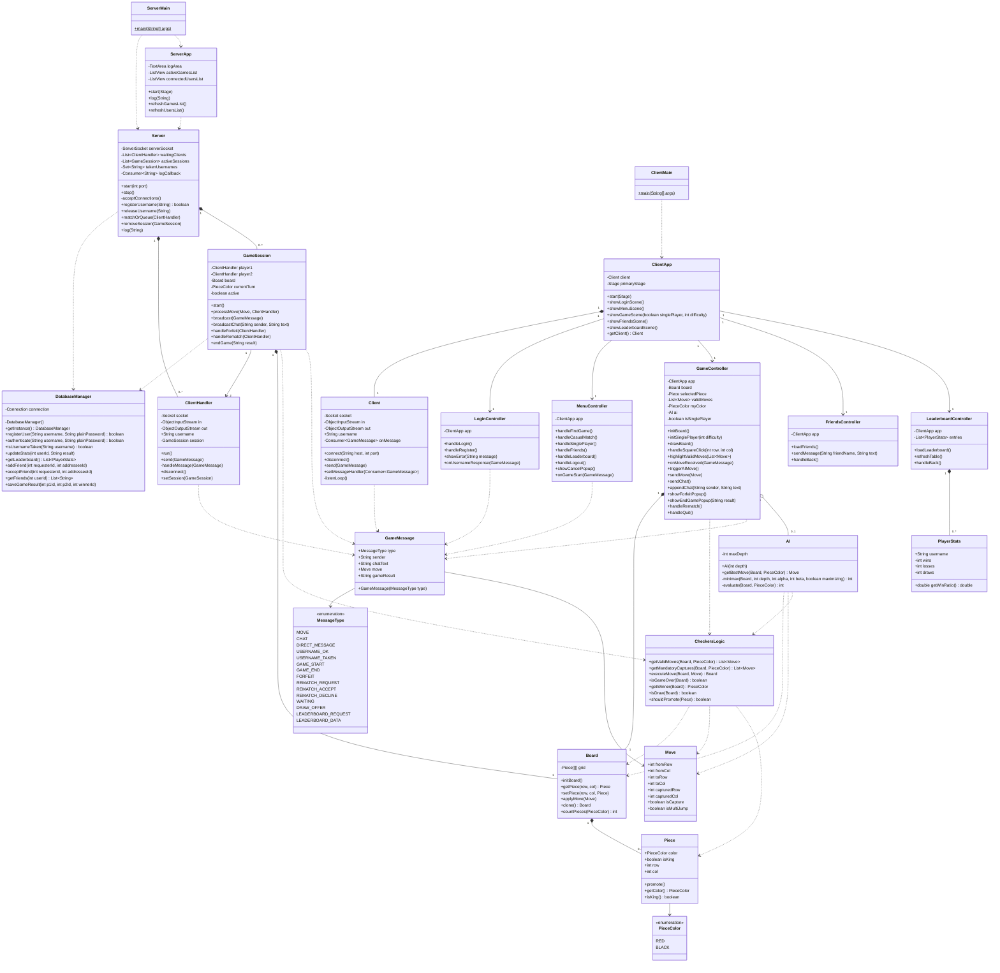

# Online Checkers based on JavaFX + Java Sockets

A networked Checkers game supporting multiple simultaneous matches, real-time
gameplay, in-game chat, a single-player AI mode, friends list, and leaderboard.

---

## Tech Stack

**Network:** `Socket`, `ServerSocket`, `Thread`, `ObjectInputStream`, `ObjectOutputStream`  
**GUI:** `JavaFX` — `Stage`, `Scene`, `GridPane`, `Button`, `Label`, `Circle`, `Rectangle`, `MouseEvent`, `EventHandler`  
**Shared:** `Serializable` objects passed over the socket streams  
**Database:** PostgreSQL (cloud-hosted) via JDBC (`org.postgresql:postgresql` driver), BCrypt for password hashing (`org.mindrot:jbcrypt`)

---

## Project Requirements

a) The server must support multiple pairs of clients each playing a game of Checkers simultaneously.  
b) The app must correctly determine a win, loss, or draw; at the end of each game there should be an option to play again with the same player or quit.  
c) The client must use a GUI with graphical elements. The GUI should be intuitive and all user actions clearly labeled.  
d) The server must print a log of all activity. A server GUI is optional but useful.  
e) Users must create a unique username when logging on; duplicate usernames should give an error and prompt for a new one.  
f) Players in a game should be able to send text messages to each other.  
g) All scenes must be reachable; neither client nor server should freeze or crash during gameplay.

---

## File Structure

### Shared (used by both client and server)

| File | Responsibility |
|---|---|
| `GameMessage.java` | Serializable network protocol object sent over sockets. Contains a `MessageType` enum (MOVE, CHAT, DIRECT_MESSAGE, USERNAME_OK, USERNAME_TAKEN, GAME_START, GAME_END, FORFEIT, REMATCH_REQUEST, REMATCH_ACCEPT, REMATCH_DECLINE, WAITING, DRAW_OFFER, LEADERBOARD_REQUEST, LEADERBOARD_DATA) and all relevant data fields. |
| `Move.java` | Represents a single checker move: fromRow/Col, toRow/Col, captured piece coordinates, and whether it's a multi-jump. |
| `PieceColor.java` | Enum with two values: `RED` and `BLACK`. Used by `Piece`, `CheckersLogic`, and `AI`. |
| `Piece.java` | Represents one checker piece: color (RED/BLACK), king status, and board position. |
| `Board.java` | 8×8 board state as a `Piece[][]`. Methods to init, clone, get, and apply moves. Does NOT contain rules — pure state only. |
| `PlayerStats.java` | Plain data class holding a player's username, wins, losses, draws, and computed W/L ratio. Serialized inside `LEADERBOARD_DATA` messages. |

### Game Logic (pure, no UI, no network)

| File | Responsibility |
|---|---|
| `CheckersLogic.java` | All game rules: compute valid moves, execute a move, detect captures, jump and multi-jumps, promote to king, check win/draw conditions. |
| `AI.java` | Minimax-based AI opponent. Constructed with a search depth; recursively evaluates board states with alpha-beta pruning. Exposes `getBestMove(Board, PieceColor) Move`. Used only client-side for single-player mode, the server is not involved. |

### Database (server-side only)

| File | Responsibility |
|---|---|
| `DatabaseManager.java` | Opens a JDBC connection to the cloud PostgreSQL instance using the URL read from `config.properties`. Provides all SQL operations: register user, authenticate, update stats, fetch leaderboard, manage friends. |
| `config.properties` | **Not committed to git.** Contains `db.url`, `db.user`, `db.password`. |

### Server-Side

| File | Responsibility |
|---|---|
| `ServerMain.java` | Entry point. Launches `Server` and `ServerApp` GUI. |
| `Server.java` | Accepts connections, manages the list of connected `ClientHandler`s and active `GameSession`s, enforces unique usernames, and matches waiting players into sessions. |
| `ClientHandler.java` | One thread per connected client. Reads `GameMessage`s off the socket and routes them to the correct `GameSession` or back to `Server`. |
| `GameSession.java` | Owns one `Board` and two `ClientHandler`s. Processes validated moves, broadcasts state, handles forfeits, detects end-of-game, and manages rematch flow. |
| `ServerApp.java` | JavaFX server GUI: scrolling log, list of active sessions and connected users. |

### Client-Side

| File | Responsibility |
|---|---|
| `ClientMain.java` | Entry point. Launches the JavaFX `ClientApp`. |
| `ClientApp.java` | Main `Application` subclass. Owns the `Client` connection and the primary `Stage`. Switches between scenes (Login → Menu → Game). |
| `Client.java` | Manages the socket connection, sends `GameMessage`s, and delivers incoming messages to a registered callback on the JavaFX thread via `Platform.runLater`. |
| `LoginController.java` | Login and Register scene controller. Validates input, sends username to server, handles USERNAME_OK / USERNAME_TAKEN responses. |
| `MenuController.java` | Main menu scene. Buttons: Find Game (Ranked), Casual Match, Single Player, Friends, and Leaderboard. Handles the "Waiting for opponent…" state and Cancel popup. |
| `GameController.java` | Game scene controller. Renders the board, handles piece selection and move highlighting (possible moves), sends moves to server (or drives AI in single-player), receives opponent moves, manages the chat panel, and shows end-of-game dialogs (Play Again / Quit). |
| `FriendsController.java` | Friends scene controller. Shows the friends list with online status and direct message input. |
| `LeaderboardController.java` | Leaderboard scene controller. Fetches and displays a ranked table of all players stats (username, wins, losses, W/L ratio). |

### Resources

| File | Responsibility |
|---|---|
| `style.css` | JavaFX CSS for both client scenes and optional server GUI. |
| `config.properties` | Connection config loaded at server startup (see Database section). |
| `Piece.mp3` | Sound effect for piece movement. |
| `Click.mp3` | Sound effect for button clicks. |

---

## Scenes (Client GUI)

| Scene | Description |
|---|---|
| Login | Username/password fields + Sign Up link |
| Register | Register form + "Already have an account? Login" link |
| Menu | Find Game (Ranked), Casual Match, **Single Player**, Friends, **Leaderboard** buttons |
| Game (Waiting) | Board grayed out, "Searching for opponent…" status, Cancel popup |
| Game (Playing — Online) | Live board, player name headers, chat panel + message input, Forfeit button |
| Game (Playing — vs AI) | Same layout; opponent label shows "AI (Easy/Medium/Hard)"; no chat panel |
| End-of-Game popup | Shows result (Win / Loss / Draw), Play Again and Quit buttons |
| Forfeit popup | "Forfeit the match? You will lose 15p" — No / Yes |
| Log Out popup | "Log out?" — No / Yes |
| Friends | Friends list with online indicator, message input per friend |
| Leaderboard | Ranked table: Rank, Username, Wins, Losses, W/L ratio |

---

## Database

### Why cloud-hosted PostgreSQL?

Since SQL is not installed on every machine, it will allow run this project with Java only
All database related operations are going executed on a cloud-hosted PostgreSQL instance.

### Schema

```sql
-- Stores login credentials.
-- Passwords are stored as BCrypt hashes
CREATE TABLE users (
    id       SERIAL PRIMARY KEY,
    username VARCHAR(32)  UNIQUE NOT NULL,
    password VARCHAR(60)  NOT NULL,           -- BCrypt hash (60 chars)
    created_at TIMESTAMPTZ DEFAULT now()
);

-- One row per user; updated after every completed online game.
CREATE TABLE player_stats (
    user_id  INT PRIMARY KEY REFERENCES users(id) ON DELETE CASCADE,
    wins     INT NOT NULL DEFAULT 0,
    losses   INT NOT NULL DEFAULT 0,
    draws    INT NOT NULL DEFAULT 0
);

-- Bidirectional friendships stored as two directed rows.
-- status: 'pending' | 'accepted'
CREATE TABLE friends (
    requester_id INT REFERENCES users(id) ON DELETE CASCADE,
    addressee_id INT REFERENCES users(id) ON DELETE CASCADE,
    status       VARCHAR(10) NOT NULL DEFAULT 'pending',
    PRIMARY KEY (requester_id, addressee_id)
);

-- persists completed game results for WIN/LOSS/DRAW stats
CREATE TABLE game_history (
    id          SERIAL PRIMARY KEY,
    player1_id  INT REFERENCES users(id),
    player2_id  INT REFERENCES users(id),
    winner_id   INT REFERENCES users(id),    -- NULL = draw
    played_at   TIMESTAMPTZ DEFAULT now()
);
```

### `DatabaseManager` operations

| Method | SQL action |
|---|---|
| `registerUser(username, plainPassword)` | `INSERT INTO users`; also inserts a zeroed `player_stats` row; hashes password with BCrypt before storing |
| `authenticate(username, plainPassword)` | `SELECT password FROM users WHERE username = ?`; verifies BCrypt hash |
| `isUsernameTaken(username)` | `SELECT 1 FROM users WHERE username = ?` |
| `updateStats(userId, result)` | `UPDATE player_stats SET wins/losses/draws = wins/losses/draws + 1` |
| `getLeaderboard()` | `SELECT u.username, s.wins, s.losses, s.draws FROM player_stats s JOIN users u ...  ORDER BY wins DESC` |
| `addFriend(requesterId, addresseeId)` | `INSERT INTO friends` |
| `acceptFriend(requesterId, addresseeId)` | `UPDATE friends SET status = 'accepted'` |
| `getFriends(userId)` | `SELECT ... FROM friends WHERE ... AND status = 'accepted'` |
| `saveGameResult(p1Id, p2Id, winnerId)` | `INSERT INTO game_history` |

---

## UML Class Diagram



---

## Key Design Decisions

- **`GameMessage` as the single protocol type** — all server↔client communication is one serializable object with a `MessageType` tag. This avoids instanceof chains and is easy to extend.
- **`CheckersLogic` is stateless** — it takes a `Board` and returns results. This makes it trivially reusable for both server-side move validation and client-side move highlighting.
- **`Board.clone()`** — the server validates moves on a clone before applying them to the real board, preventing cheating by a malformed message.
- **`Platform.runLater` in `Client`** — all incoming messages are dispatched back onto the JavaFX Application Thread before touching any UI node.
- **`ClientHandler` runs on its own thread** — the server never blocks waiting for one client while others are active.
- **Scene switching in `ClientApp`** — one `Stage`, swap `Scene`s. Controllers hold a reference to `ClientApp` to trigger transitions.
- **`AI` is client-only** — single-player games never touch the server. `GameController` calls `triggerAIMove()` on a background thread after each player move, then applies the result via `Platform.runLater`.
- **`AI` difficulty = search depth** — Easy = depth 2, Medium = depth 4, Hard = depth 6. Alpha-beta pruning keeps Hard playable in real time.
- **`PlayerStats` is a plain data class** — the server serializes stats into `GameMessage` payloads (new `LEADERBOARD_DATA` message type); the client deserializes and populates the `LeaderboardController` table.
- **Friends list** is display-only for now; direct messaging reuses the same chat `GameMessage` infrastructure with a new `DIRECT_MESSAGE` type.
